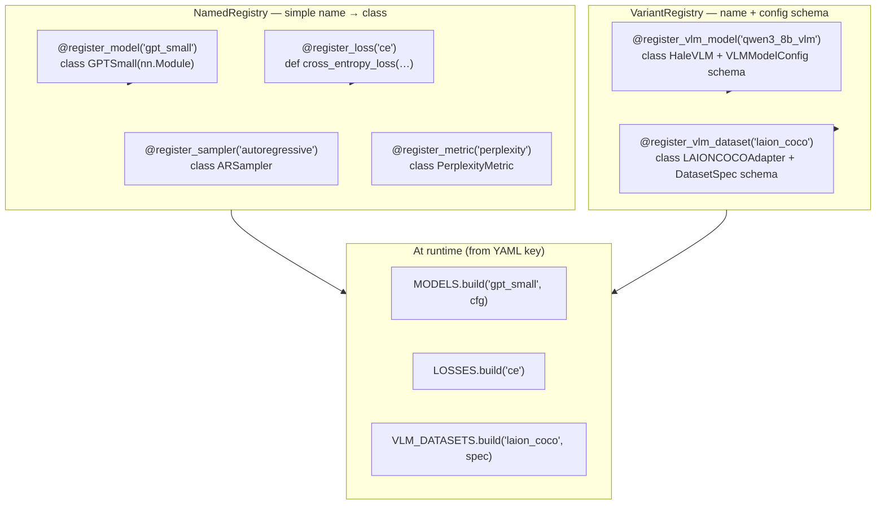
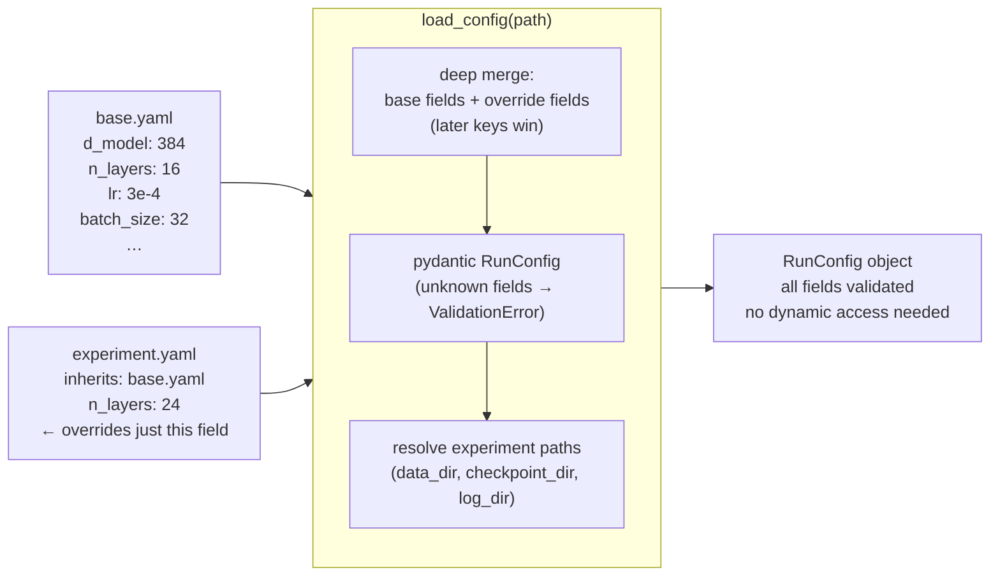
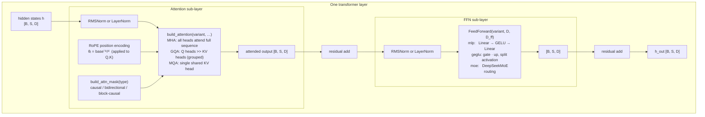
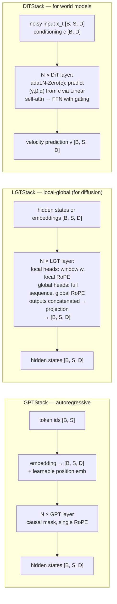
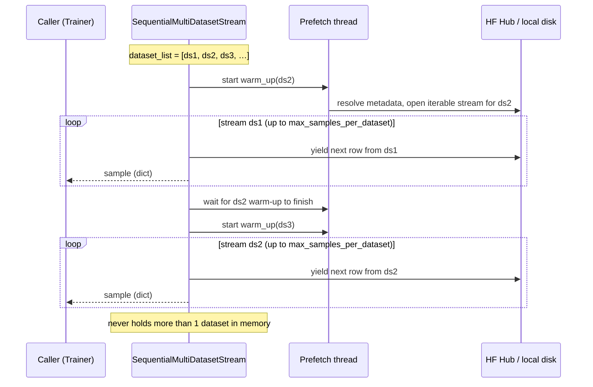
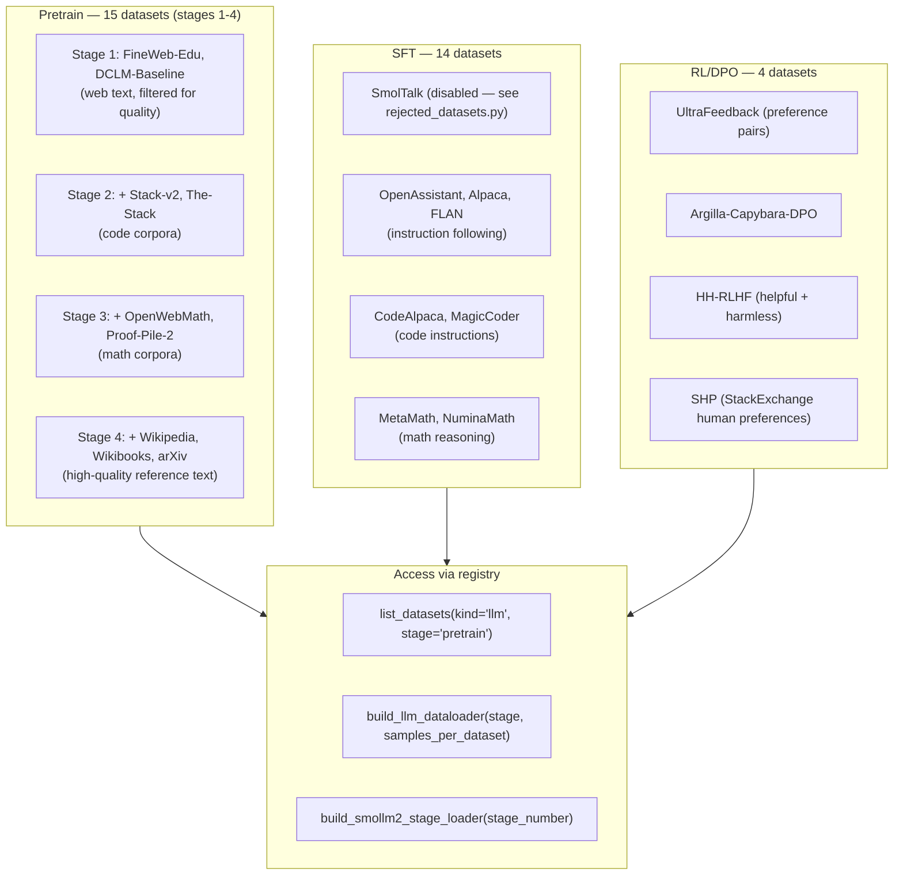
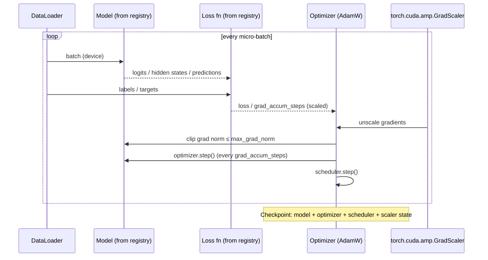

# Architecture

Mermaid diagrams (render on GitHub). See also the [project page](../project-page/index.html)
and the [README](../README.md) for a laymen overview.

---

## 1. Registry system

HaleBlocks uses two registry types. `NamedRegistry` maps a string key to a class or function. `VariantRegistry` also stores the config schema for each variant, enabling strict per-variant validation.

---

## 2. Config system — strict pydantic with inheritance

---

## 3. Transformer building blocks

---

## 4. Transformer stacks

---

## 5. Sequential streaming data loader

---

## 6. LLM dataset registry (SmolLM2 recipe)

---

## 7. Trainer loop

