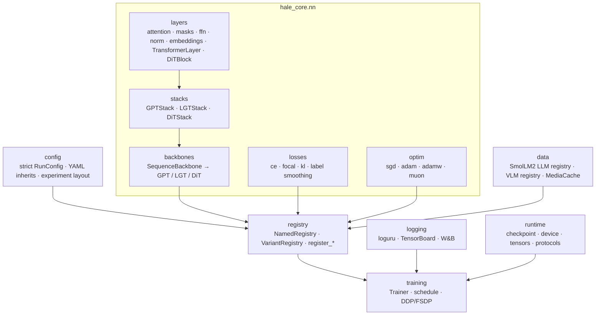
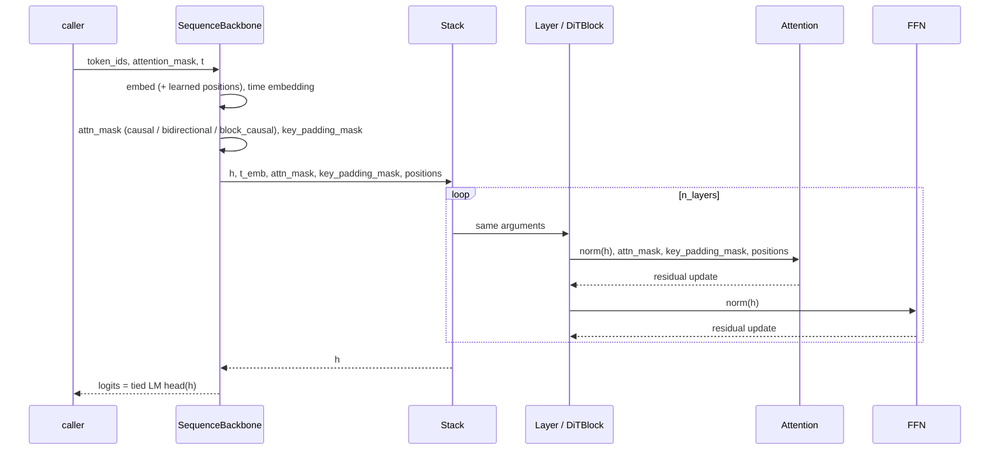
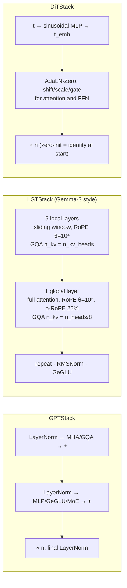
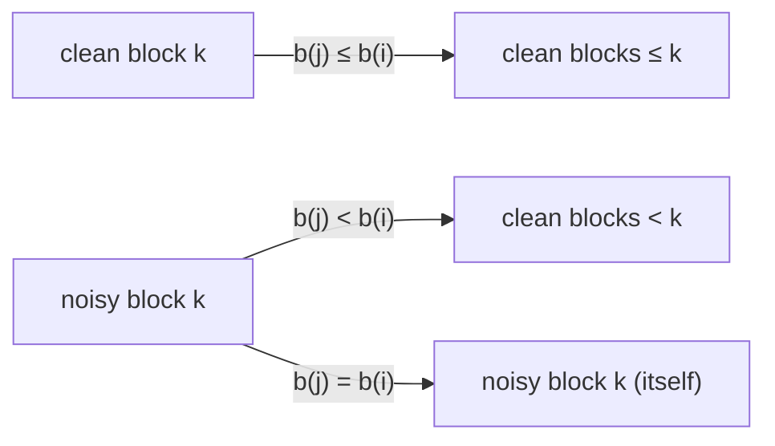
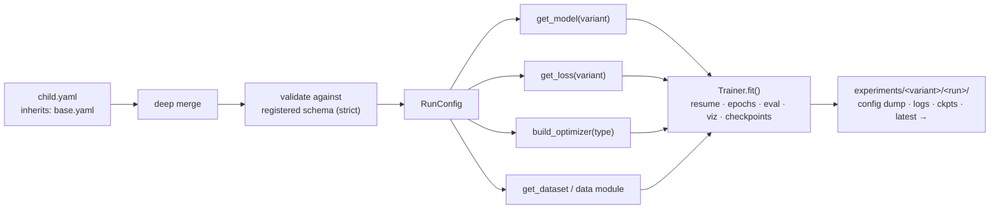

# Architecture

Mermaid diagrams (they render on GitHub). The same figures appear on the
[project page](../project-page/index.html) and in the [paper](../paper/main.tex).

## 1. Package map



## 2. Forward contract



## 3. The three stacks



## 4. Block-causal mask (block diffusion)

Clean copy `x^c` and noisy copy `x^n` are concatenated (length `2n`). Block index `b(i)`:



Example (`n = 4`, `block_size = 2`; `1` = blocked):

```
            c0 c1 c2 c3 | n0 n1 n2 n3
clean  0 :   0  0  1  1 |  1  1  1  1
clean  2 :   0  0  0  0 |  1  1  1  1
noisy  0 :   1  1  1  1 |  0  0  1  1
noisy  2 :   0  0  1  1 |  1  1  0  0
```

## 5. From YAML to a trained model


