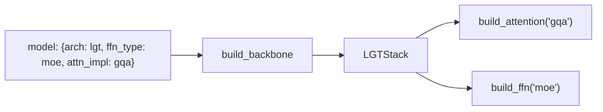

# Stop copying attention.py: a registry for transformer research

*2026-09-28 · B A NaveenKumar*

> **Summary.** Every new research repo starts by copying `attention.py`, `moe.py` and a
> training loop from the previous one, and the copies drift apart. HaleBlocks (`hale_core`)
> is the library these repos share: attention, FFN and MoE, masks, three transformer stacks,
> backbones, losses, optimisers, strict configs, registries, a trainer and streaming data.
> This post covers the one design rule behind it and three things it makes easy.

## The rule: registries and factories, never direct imports

Each component family, whether attention, FFN, backbone, loss, optimiser, trainer, dataset
or logger, has a **named registry** and a **`build_*` factory**:

```python
ffn = build_ffn("moe", d_model=512, d_ff=2048, moe_num_experts=8, moe_top_k=2, moe_num_shared=1)
att = build_attention("gqa", d_model=512, n_heads=8, n_kv_heads=2, rope_theta=1e4)
```

A new implementation registers a name (`register_ffn("my_ffn")(MyFFN)`) and every existing
caller can use it through config, with no call site to edit. The only thing a component has
to respect is the **forward contract**: attention takes
`(x, attn_mask, key_padding_mask, positions)`, stacks map hidden states to hidden states
with an optional time embedding, and backbones map token ids to logits.



## Three things this makes easy

**1. A GPT with DeepSeek-style experts.** Change `ffn_type: mlp` to `ffn_type: moe`. With 8
routed experts, 1 shared expert and top-2 routing, a 6-layer d=256 GPT grows from 12.96M to
52.30M parameters, while per-token compute grows far less.

**2. A Gemma-3-style long-context model.** `arch: lgt` gives RMSNorm, GQA and five
sliding-window local layers (RoPE θ = 10⁴) for every global layer (RoPE θ = 10⁶, partial
"p-RoPE" on 25% of each head, fewer KV heads). The same 6-layer configuration is 13.88M
parameters.

**3. A block-diffusion language model.** `attn_type: block_causal, block_size: 16` builds
the mask used by block diffusion LMs: a clean and a noisy copy of the sequence side by
side, where each noisy block sees earlier clean blocks and itself. It took one function,
and it's tested cell by cell:

```
            c0 c1 c2 c3 | n0 n1 n2 n3        (1 = blocked, block_size = 2)
clean  0 :   0  0  1  1 |  1  1  1  1
noisy  2 :   0  0  1  1 |  1  1  0  0
```

Pair it with `arch: dit` and `use_time_cond: true` and you have a timestep-conditioned
AdaLN-Zero backbone over text.

## Configs that say no

Every config section is a pydantic model with `extra="forbid"`. A typo such as
`moe_topk: 4` is an error at load time rather than a silently ignored key. Files inherit
(`inherits: base.yaml`) and override only what changes, and each run gets its own
directory with the resolved config dumped next to the checkpoints.

## Data you'd otherwise rewrite

The SmolLM2 recipe is registered as data: 15 pretraining sources, 14 SFT datasets and 4
preference datasets, plus a one-liner for each of the four pretraining stage mixtures. For
VLMs, a sequential streamer plus an LRU `MediaCache` keeps multi-terabyte mixtures inside a
2 GiB disk budget.

## Status

114 tests (unit, smoke, integration) pass in about four seconds on CPU, and pre-commit runs
lint, format and the fast tests on every commit. Known limits: the MoE loops over experts
in Python with no load-balancing loss, and there is no KV cache or fused kernels yet.
Hale-VLM already builds on HaleBlocks as a thin plugin package.

Code, paper and diagrams:
[github.com/basaanithanaveenkumar/HaleBlocks](https://github.com/basaanithanaveenkumar/HaleBlocks).
