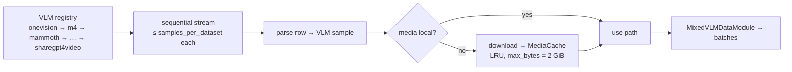

# Data

## LLM: SmolLM2 recipe (33 datasets)

| Stage | Count | Datasets |
|---|---|---|
| pretrain | 15 | `fineweb_edu`, `dclm`, `openwebmath`, `infimm_webmath`, `finemath4_plus`, `finemath3_plus`, `infi_webmath4_plus`, `infi_webmath3_plus`, `aug_gsm8k`, `starcoderdata`, `stack_edu`, `starcoder2data`, `starcoder2_jupyter`, `cosmopedia_v2`, `dolma_books` |
| finetune | 14 | `smoltalk`, `magpie_ultra`, `smol_constraint`, `smol_rewrite`, `smol_summarization`, `numinamath_cot`, `metamathqa`, `self_oss_starcoder2_instruct`, `apigen_function_calling`, `systemchats2`, `longalign`, `everyday_conversations`, `explore_instruct`, `openhermes25` |
| rl | 4 | `ultrafeedback`, `ultrainteract`, `capybara`, `orca_dpo` |

```python
from hale_core.data import build_llm_dataloader, build_smollm2_stage_loader, SMOLLM2_PRETRAIN_STAGES
build_smollm2_stage_loader(1, samples_per_dataset=500)   # stage 1 mixture
```

## VLM



Install the streaming extras with `uv sync --extra llm`, `--extra vlm` or `--extra data`.
